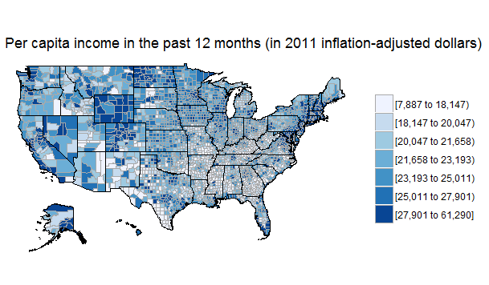
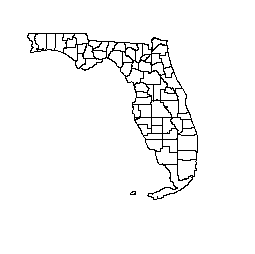
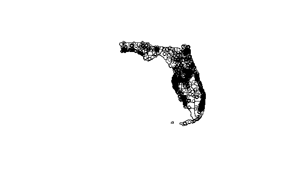
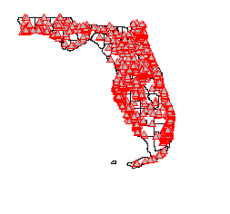

Introduction to R packages for geospatial data
----------------------------------------------

This tutorial introduces a variety of R packages that may be used to manipulate and visualize geospatial data in R. Below we provide short descriptions of the packages used in each example throughout this tutorial, which can to be installed with the following code:

``` r
install.packages(c("acs", "choroplethr", "choroplethrMaps", "maptools", "rgeos", 
    "mapproj", "RColorBrewer", "maps", "geosphere", "rgdal", "reshape", "ggplot2"))
```

### Packages used in:

-   Example 1: mapping census data
    -   **ACS** & **choroplethr** - can be used together to easily make choroplethGCT-PEPANNRES maps using data from the American Community Survey (ACS), yearly census data collected by the U.S. Census Bureau. To access ACS data you need an API key. Visit <http://api.census.gov/data/key_signup.html>, request a key, and paste it into the line below:
    -   **choroplethrMaps** - contains a global map and maps of the USA used by the choroplethr package.

``` r
api.key.install("<ACS API key>")
```

-   Example 2: working with shapefiles, projections, and visualization
    -   **maptools** - contains functions for reading and manipulating geographic data, including ESRI shapefiles.
    -   **rgdal** - geospatial data abstraction and projection / transformation.
    -   **RColorBrewer** - provides color schemes that are especially useful for creating thematic maps.
    -   **ggplot2** - package for creating and customizing graphics is R.
    -   **rgeos** - contains functions for performing geometric analysis. For example `gLength()` calculates the length of input geometry, while `gBuffer()` adds a buffer to an input feature.
    -   **mapproj** - WHERE IS THIS USED? simple package for converting from latitude and logitude into projected coordinates.
-   Example 3: network-type map
    -   **maps** another simple set of tools for creating maps, with links to several databases of spatial data.
    -   **geosphere** - supports trigonometric calculations for geographic applications. For example, computing distance to the horizon from a given location and altitude.
    -   **reshape** - reshapes data from 'wide' format (where repeated measurements are located across multiple columns) to 'long' format (where repeated measurements are spread across unique rows)

EXAMPLE 1: mapping census data
==============================

### Packages used - **ACS**, **choroplethr**, **choroplethrMaps**

After installing (see introduction), load needed packages:

``` r
library(acs)
library(choroplethr)
library(choroplethrMaps)
```

We need an api key to access the ACS data. Visit <http://api.census.gov/data/key_signup.html>, request a key, and paste it into the line below:

``` r
api.key.install("<ACS API key>")
```

Great, now we have access to the census data. Table B19301 contains per capita income for the year of 2011. Lets plot it!

``` r
county_choropleth_acs(tableId="B19301")
```



To see the description of a function and its arguments in R, place a "?" before its name:

``` r
?county_choropleth_acs
```

EXAMPLE 2: working with shapefiles, projections, and visualization
==================================================================

### Packages used - **maptools, rgdal, RColorBrewer, ggplot2**

``` r
library(maptools)
library(rgdal)
```

In this example we will work with the data provided along with this tutorial. **Make sure you have unzipped the folder county\_census before proceeding!** The following prompts you to select the provided county census shapefiles at the path ...county\_census/County\_2010Census\_DP1.shp.

``` r
counties <- readShapeSpatial(file.choose(),proj4string=CRS("+proj=longlat +datum=WGS84"))
```

Note that the second parameter of the maptools function `readShapeSpatial` was a string representing the projection of the data, called a `prj4` string. So far we've used "+proj=longlat +datum=WGS84", which is simply unprojected longitude and latitude coordinates.

Inspect the first few rows of the counties data to get a feel for its structure:

``` r
head(counties@data)
```

Census data assigns codes to counties using the Federal Information Processing Standard (FIPS). A FIPS code starts with two digits representing the state, and is followed by three digits representing the county. For example, Florida is 12 and Clay County Florida is 12019. To select all the counties in Florida we can use a regular expression matching all codes that start with "12":

``` r
florida <- counties[substring(counties$GEOID10,1,2)=="12",]
plot(florida)
```

<center>

</center>
You can look up other state and county codes using the U.S. Census Bureau site: <https://www.census.gov/geo/reference/codes/cou.html>

### Projection and Layering with RGDAL

Next we'll work more with projections using library `rgdal`. We're going to read in a shape file of cultural points in Florida from the supplied data, again using function `readShapeSpatial()`. We know already that our cultural centers layer uses NAD83(HARN) / Florida GDL Albers. We can make the EPSG data frame of projections to find the `prj4` string for this projection (use `?make_EPSG()` to find out more about this table):

``` r
library(rgdal)
EPSG <- make_EPSG()
```

We can use regular expressions to search the note field of `EPSG` for any that refer to Florida:

``` r
EPSG[grep("florida", EPSG$note, ignore.case=TRUE), 1:2]
```

    ##       code                                     note
    ## 705   2236            # NAD83 / Florida East (ftUS)
    ## 706   2237            # NAD83 / Florida West (ftUS)
    ## 707   2238           # NAD83 / Florida North (ftUS)
    ## 1245  2777             # NAD83(HARN) / Florida East
    ## 1246  2778             # NAD83(HARN) / Florida West
    ## 1247  2779            # NAD83(HARN) / Florida North
    ## 1349  2881      # NAD83(HARN) / Florida East (ftUS)
    ## 1350  2882      # NAD83(HARN) / Florida West (ftUS)
    ## 1351  2883     # NAD83(HARN) / Florida North (ftUS)
    ## 1553  3086             # NAD83 / Florida GDL Albers
    ## 1554  3087       # NAD83(HARN) / Florida GDL Albers
    ## 1978  3511         # NAD83(NSRS2007) / Florida East
    ## 1979  3512  # NAD83(NSRS2007) / Florida East (ftUS)
    ## 1980  3513   # NAD83(NSRS2007) / Florida GDL Albers
    ## 1981  3514        # NAD83(NSRS2007) / Florida North
    ## 1982  3515 # NAD83(NSRS2007) / Florida North (ftUS)
    ## 1983  3516         # NAD83(NSRS2007) / Florida West
    ## 1984  3517  # NAD83(NSRS2007) / Florida West (ftUS)
    ## 3074  6437             # NAD83(2011) / Florida East
    ## 3075  6438      # NAD83(2011) / Florida East (ftUS)
    ## 3076  6439       # NAD83(2011) / Florida GDL Albers
    ## 3077  6440            # NAD83(2011) / Florida North
    ## 3078  6441     # NAD83(2011) / Florida North (ftUS)
    ## 3079  6442             # NAD83(2011) / Florida West
    ## 3080  6443      # NAD83(2011) / Florida West (ftUS)
    ## 3747 26758                   # NAD27 / Florida East
    ## 3748 26759                   # NAD27 / Florida West
    ## 3749 26760                  # NAD27 / Florida North
    ## 3895 26958                   # NAD83 / Florida East
    ## 3896 26959                   # NAD83 / Florida West
    ## 3897 26960                  # NAD83 / Florida North

We see the code we're looking for is 3087. Extract the `prj4` string from this dataframe:

``` r
subset(EPSG, code==3087)
prjstring <- subset(EPSG, code==3087)$prj4
```

Inspect our `prjstring` variable if you want to see the format of the `prj4` variable.

Now that we have the appropriate `prj4` we can read in the cultural centers data. The following prompts you to select the shape file. Select the actual `.shp` file in the provided data from ...cultural\_centers/gc\_culturecenter\_oct15.shp.

``` r
cultural <- readShapeSpatial(file.choose(),proj4string=CRS(prjstring))
```

Before we overlay the cultural points, we need to transform this layer to match that of the Florida counties layer - simple longitude and latitude in WGS84:

``` r
cultural_proj <- spTransform(cultural, CRS("+proj=longlat +datum=WGS84"))

plot(florida)
points(cultural_proj)
```

<center>

</center>
You can play around with the symbology for your map with some additional arguments in the `points` function. For example:

``` r
plot(florida)
points(cultural_proj, cex=.8, pch=24, col=554, bg="grey")
```

<center>

</center>
join polygon data to points
---------------------------

``` r
county_data <- over(cultural_proj,florida)
cultural_proj$pop <- county_data$DP0010001
```

set colors
----------

``` r
library(RColorBrewer)
```

``` r
brks <- c(.5,1,1.5,2) * 1000000
cols <- brewer.pal(5,"Greens")

mapcols <- cols[findInterval(cultural_proj$pop, vec=brks)]
plot(cultural_proj,col=mapcols,pch=20)
```

#### base R instructions for choropleth

``` r
brks <- c(25,30,35,40,45,50,55,60,65)
cols <- brewer.pal(8,"Purples")

mapcols <- cols[findInterval(florida$DP0020001, vec=brks)]
plot(florida,col=mapcols,border="white")

legend("bottomleft", legend = levels(cut(florida$DP0020001, brks)), fill = cols, title = "Median Age")
```

### using ggplot2

``` r
library(ggplot2)
```

``` r
fl_shapes <- fortify(florida,region="GEOID10")

ggplot() + geom_map(data=as.data.frame(florida),aes(map_id = GEOID10,fill=DP0020001), map=fl_shapes) + expand_limits(x=fl_shapes$long, y=fl_shapes$lat) + scale_fill_gradient2(low="seagreen",mid="white",high="darkorchid4",midpoint=47,limits=c(29,65)) + coord_map(projection="mercator")
```

EXAMPLE 3: network-type map
===========================

### Packages used - **maps, geosphere, reshape**

``` r
library(maps)
library(geosphere)
library(reshape)
```

select - state\_shapes/tl\_2014\_us\_state.shp
----------------------------------------------

``` r
state <- readShapeSpatial(file.choose())
```

select - /state\_migrations\_2014.csv
-------------------------------------

``` r
migration <- read.csv(file.choose())
```

``` r
centrs <- data.frame(as.character(state@data$NAME),coordinates(state))
colnames(centrs) <- c("name","long","lat")
```

Reshape - melt
--------------

``` r
migration <- migration[c(1,6:56)]
long_mig <- melt(migration,id.vars="from_state") 

map("state")
```

define draw\_from\_state function
---------------------------------

<just describe roughly what the following function does. If they want to use it, they can figure it out>

``` r
draw_from_state <- function(centrs, migrations, state_name, color=rgb(0,0,0,alpha=0.5)) {
    migrations$variable <- sub("."," ",migrations$variable,fixed=TRUE)
    migrations <- migrations[migrations$variable==state_name & migrations$from_state != state_name,]
    for(i in 1:nrow(migrations)){
        if (nrow(centrs[centrs$name==as.character(migrations[i,]$from_state),]) > 0){
            from_long <- centrs[centrs$name==as.character(migrations[i,]$from_state),]$long
            from_lat <- centrs[centrs$name==as.character(migrations[i,]$from_state),]$lat
            to_long <- centrs[centrs$name==as.character(migrations[i,]$variable),]$long
            to_lat <- centrs[centrs$name==as.character(migrations[i,]$variable),]$lat
            number <- migrations[i,]$value
            lines(gcIntermediate(c(from_long, from_lat), c(to_long, to_lat), n=50, addStartEnd=TRUE),lwd=sqrt(number)/50,col=color)
        }
    }
}
```

``` r
draw_from_state(centrs, long_mig, "Florida", rgb(0,0,1,0.5))
```

``` r
xlim <- c(-171.738281, -56.601563)
ylim <- c(12.039321, 71.856229)
map("world", col="#f2f2f2", fill=TRUE, bg="white", lwd=0.05, xlim=xlim, ylim=ylim)

draw_from_state(centrs, long_mig, "Wyoming", rgb(1,0,0,.5))
```
